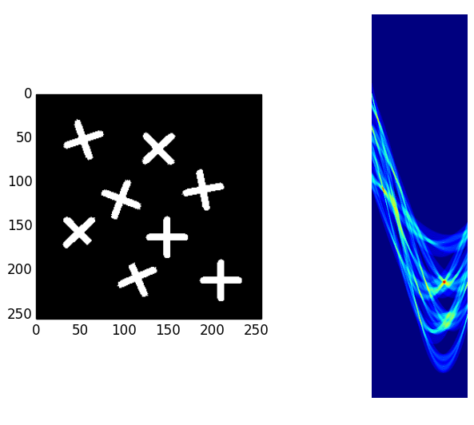

# Hough Transform - Line Detection
[](https://travis-ci.org/alyssaq/hough_transform)

Python implementation of hough transform for detecting lines in images.    
Explanation of how the hough transform works in my blog post: [Understanding Hough Transform](https://alyssaq.github.io/2014/understanding-hough-transform)

## Requirements
* Tested on Python 2.7 and Python 3.6
* `pip install -r requirements.txt`

## Usage
```py
python hough_transform.py
```
## Sample 


## Tests
```py
python hough_transform_test.py
```

## Resources
* OpenCV's hough transform documentation: 
<http://docs.opencv.org/doc/tutorials/imgproc/imgtrans/hough_lines/hough_lines.html>
* EGGN 512 hough transform lecture in 3 parts:
<https://www.youtube.com/watch?v=uDB2qGqnQ1g>